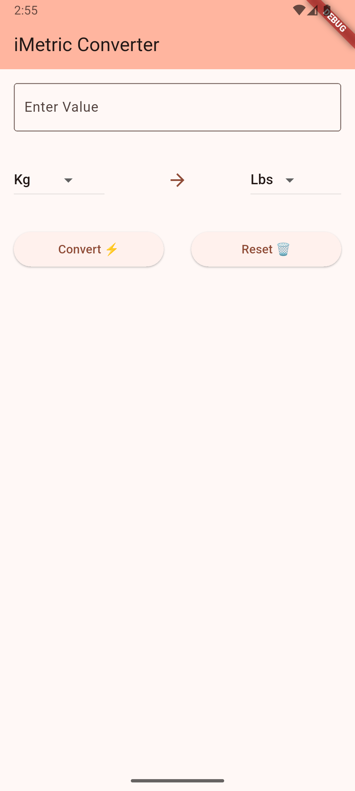
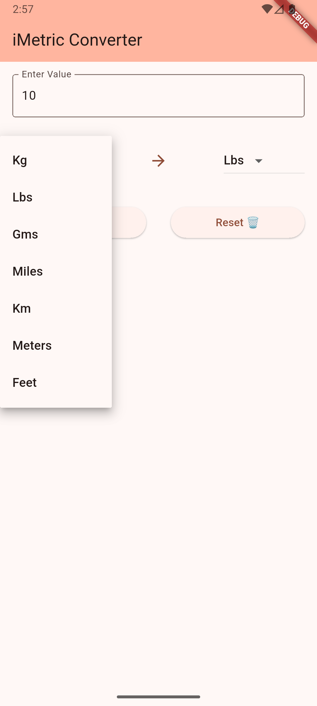
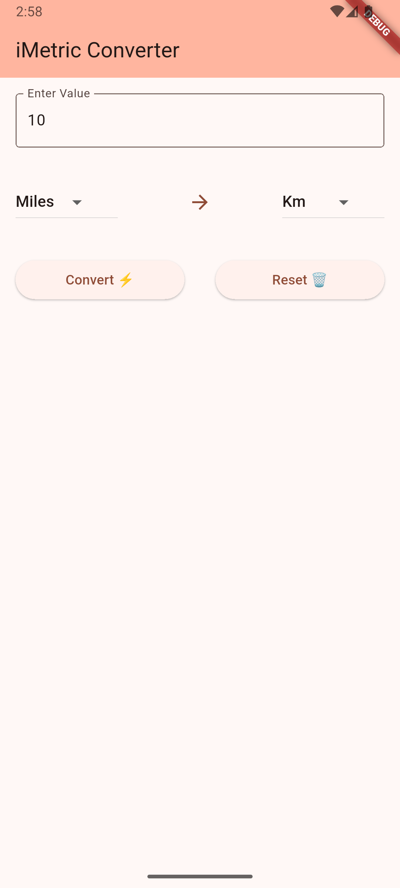
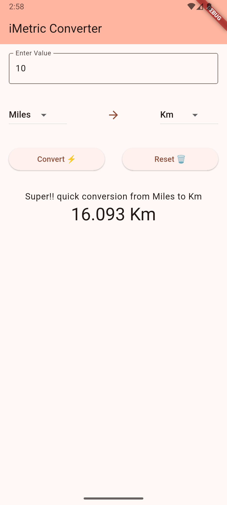
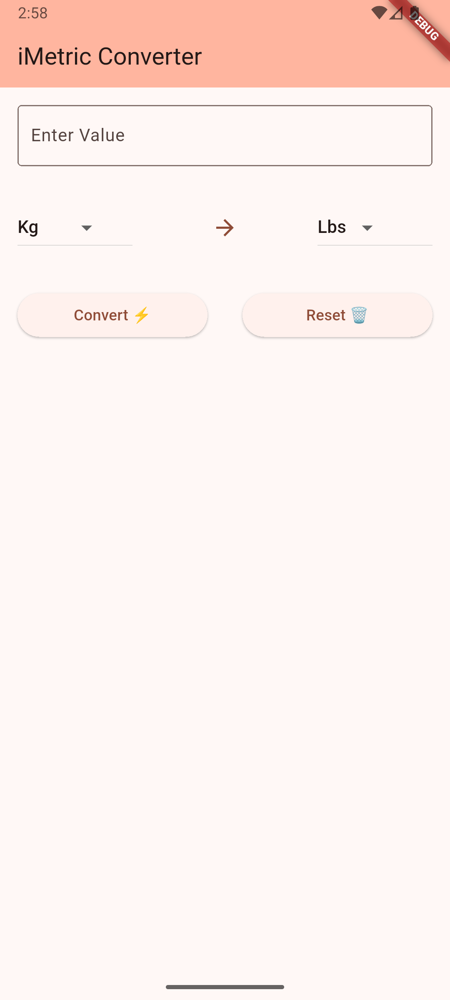

# iMetric Converter

A simple, fast, and user-friendly Flutter application for everyday unit conversions.

## Features

- **Quick Conversions**: Convert between common units with just a few taps
- **Clean Interface**: Simple, intuitive design for effortless use
- **Wide Range of Units**: Supports multiple measurement categories

## Supported Conversions

### Weight
- Kilograms (kg) ↔️ Pounds (lbs)
- Kilograms (kg) ↔️ Grams (g)
- Pounds (lbs) ↔️ Grams (g)

### Distance/Length
- Miles ↔️ Kilometers (km)
- Miles ↔️ Meters (m)
- Miles ↔️ Feet (ft)
- Kilometers (km) ↔️ Meters (m)
- Kilometers (km) ↔️ Feet (ft)
- Meters (m) ↔️ Feet (ft)

## Installation

1. Clone this repository
2. Run `flutter pub get` to install dependencies
3. Run `flutter run` to start the app

## Screenshots

  
  
  
  
  

## Technology

Built with Flutter, enabling cross-platform functionality on both iOS and Android devices.

## Future Enhancements

- Temperature conversions
- Volume conversions
- Currency conversions with real-time rates
- Saving favorite conversions

## License

This project is licensed under the MIT License - see the LICENSE file for details.